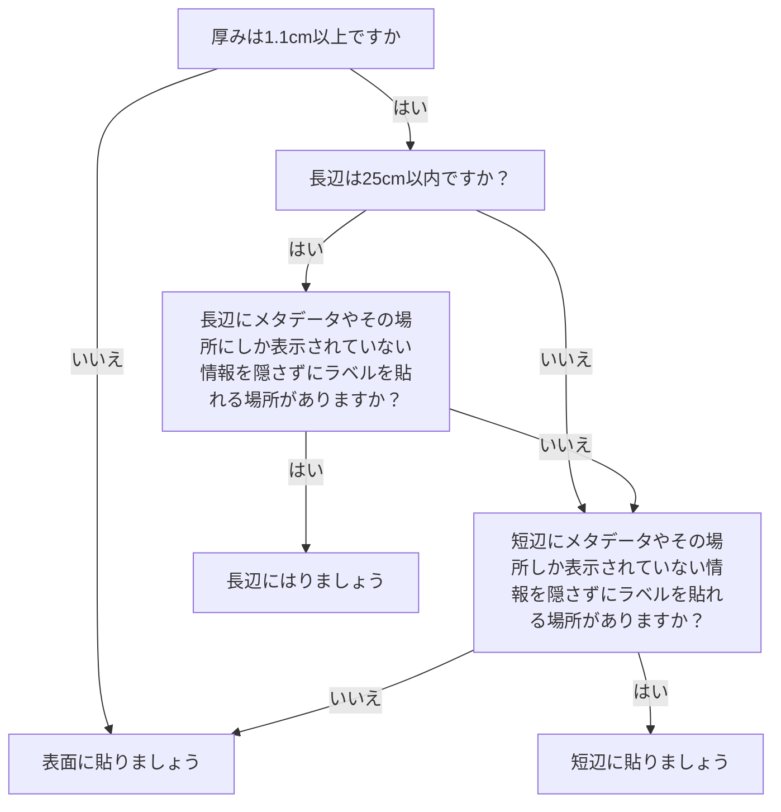

# アナログゲーム資料受入時データ作成フロー

## 方針
- 本目録作成では、商品単位でアナログゲームを記述したデータセットが少ないことを鑑みて、まず、種別（ag:Instance の種別 e.g. テーブルトップゲーム、冊子など）・ラベル（商品名）・バーコード（JANコード）・個別資料ID・由来・登録日によるインデックス作成を行う。
- また並行して、資料の撮影を行い、サムネイルを公開するほか、管理者権限で高精細な画像を閲覧可能としてオンラインでの目録作成が可能な環境を構築する。
- これらが終わった後に、パッケージの物理的な特徴（ag:TabletopGame）の実体の記述を進める。また、内容（作品）のデータはBGGやボドゲーマで記述される作品（Work）データとの接続と、それらからの継承で拡充する方向：この辺りのコミュニティ生成データに記録されない資料現物の情報粒度でのデータ入力に注力する
## 前提
- 受け入れ資料の件数より多いラベル（QRコード）を準備する。
    - [下段](https://paper.dropbox.com/doc/--B8Aq9QNkgNG0NzdnvrgW61eJAg-uKq7h9WK2L0h0wjeRcHN7#:uid=199116048548337015981820&h2=%E3%83%A9%E3%83%99%E3%83%AB%E4%BB%95%E6%A7%98%E6%A1%88)に詳細あり

## インデックス作成フロー
1. 受け入れ全資料へのラベル貼付
- シュリンク、輪ゴム、付箋、シールは取り外す。
- 汚れがある場合、清拭・除去する。
- 資料を以下の基準で分類し、該当のラベルを貼付する。
    - テーブルトップゲームのうち、
        - 自立する
        - 短辺が25cm以下
        - コバコバコに入らない大きさ
        のものはAから始まるID
    - テーブルトップゲームのうち小箱(単体で自立するもののうちコバコバコに入るもの)はBから始まるID
    - テーブルトップゲームのうち不定形（単体で自立せず、棚に直接差すことが困難な資料）のものはCから始まるID
    - 資料のうち冊子はDから始まるID
    - テーブルトップゲームのうち、短辺が25cmを超えるものはEから始まるID
- ラベル（QRコード）を、受け入れ資料全てに貼付する。
- ラベルの貼り方ポリシー(箱)
    **側面の幅が1.1cm以上、かつメタデータを隠さないなら側面に貼って**ください！QRコードはふちが少々欠けても読めます！！棚に挿した時に隠れる面に貼るとその資料は一生見つからなくなります！！！
    **貼り方の詳細は以下の画像を参照**してください。
                

1. メタデータとして取得可能な表示を潰さないように、より長い側面に貼る（表面を左にするとき手前にくる面）。しかし、**長辺が25cmを超える場合**は短辺に張る。
2. メタデータとして取得可能な表示を潰さないように、長い方の側面の逆側に貼る（表面を左にするとき奥側になる面）
3. 側面にラベルを貼れない場合、メタデータとして取得可能な表示を潰さないように、表面に貼る
4. 狭い場所にラベルを貼るとき、IDが見えるように貼る

悩んだら[フローチャートはこちら](https://docs.google.com/drawings/d/17yjQoeAYCRS7aRDxYCYTAM8eGRMMzkDaymCtOtrcNCc/edit?usp=sharing)。

- ラベルの貼り方ポリシー（チャック袋）
1. チャック袋内に箱が入っている場合は箱を取り出し、ラベルの貼り付けポリシー(箱)に準拠してラベルを貼る。
2. チャック袋内に箱がない場合、チャック袋の外にラベルを貼る。ラベルの種類は資料のサイズに応じ、AもしくはBを貼る。
- ラベルの貼り方ポリシー（冊子）
１．背表紙に貼る（上部を優先する。メタデータとして取得可能な表示を潰さないように、
メタデータとして取得可能な表示を潰さないようにするため、真ん中や下部に貼ってもよい。）。
２．背表紙に貼れない場合、背表紙を左にして、表紙（または裏表紙）の背表紙側の5㎝程度に貼る（上部を優先するが、メタデータとして取得可能な表示を潰さないようにするため、真ん中や下部に貼ってもよい。）。
- ラベルの上にラベルキーパーを貼る
1. Google DriveのAGMインデックスでデータを入力する（バーコードリーダも使用）
    - [https://docs.google.com/spreadsheets/d/1VkV7kpW15g3Xh5sm5n4uqSD8fLo8daN9hWng_1_ZZic/edit?usp=sharing](https://docs.google.com/spreadsheets/d/1IaVGwemBbPaGQNrSQUsOpOmFbNhKKmF_1mfQ0cFIX0I/edit?usp=sharing)
    - 各項目のデータ仕様については、上記URLの「プロパティの定義やメモ」シートを参照のこと
        - 複数人でデータを入力する場合、シート「統合用シート」の形式で、各々別のシートに入力し、作業終了後に統合する、という形で進める。複数人で同時に1つのシートを編集すると上書き・エラーが生じる可能性があるためである。
2. 配架
    - 分類に基づき、可能な限りID順に配架する。

## 画像撮影フロー
1. 撮影面にカラーチャートを上部に配置する
    1. 可能であれば定規も配置する
2. カラーチャートおよび端からXXXmm（要確認）の余白を開けて、垂直に配置する
3. 撮影する面は、平面に折り畳める箱であるか否かで2種類に分岐する
    1. 平面に折り畳める箱の場合
        1. 表面（箱を折りたたまない状態）
        2. 表面（箱を折りたたんだ状態）
        3. 裏面（箱を折りたたんだ状態）
    2. 平面に折り畳めない箱の場合
        1. 表面
        2. 裏面
        3. 側面（側面に重要なメタデータがある場合のみ撮影する）

## 画像変換フロー
1. サムネイル作成のためのトリミングとダウンサイジング

----------
https://www.dropbox.com/s/tjds9bkcjnxmwz5/Untitled%20Diagram%285%29.drawio?dl=0

----------
## ラベル仕様案

ラベル屋さんQRコード用シール
型番：31555
https://www.a-one.co.jp/product/new/np_0701/31551.html

- [Amazon](https://www.amazon.co.jp/%E3%82%A8%E3%83%BC%E3%83%AF%E3%83%B3-%E3%83%A9%E3%83%99%E3%83%AB%E3%82%B7%E3%83%BC%E3%83%AB-%E3%83%97%E3%83%AA%E3%83%B3%E3%82%BF%E5%85%BC%E7%94%A8-70%E9%9D%A2-31555/dp/B000QFC0H0/ref=sr_1_1?__mk_ja_JP=%E3%82%AB%E3%82%BF%E3%82%AB%E3%83%8A&crid=2LG6WIFYQRKZJ&keywords=31555&qid=1654700961&sprefix=31555%2Caps%2C217&sr=8-1) 737円 20シート * 70面 = 1,400
- [Amazon](https://www.amazon.co.jp/%E3%83%90%E3%83%BC%E3%82%B3%E3%83%BC%E3%83%89%E3%82%B9%E3%82%AD%E3%83%A3%E3%83%8A%E3%83%BC-%E3%83%8F%E3%83%B3%E3%83%89%E3%83%98%E3%83%AB%E3%83%89%E8%87%AA%E5%8B%951D-QR%E3%83%90%E3%83%BC%E3%82%B3%E3%83%BC%E3%83%89%E3%83%AA%E3%83%BC%E3%83%80%E3%83%BC-%E3%83%9E%E3%83%88%E3%83%AA%E3%83%83%E3%82%AF%E3%82%B9%E3%83%90%E3%83%BC%E3%82%B3%E3%83%BC%E3%83%89%E3%82%B9%E3%82%AD%E3%83%A3%E3%83%B3-%E5%9B%B3%E6%9B%B8%E9%A4%A8%E3%83%BB%E5%BA%97%E8%88%97%E3%83%BB%E3%82%AA%E3%83%95%E3%82%A3%E3%82%B9%E3%83%BB%E7%89%A9%E6%B5%81%E3%83%BB%E5%80%89%E5%BA%AB%E3%80%81%E6%A4%9C%E5%93%81%E3%80%81%E6%A3%9A%E5%8D%B8%E3%81%97%E7%AD%89%E3%81%AA%E3%81%A9%E3%81%AB%E9%81%A9%E7%94%A8/dp/B08K2DL285/ref=sr_1_5?__mk_ja_JP=%E3%82%AB%E3%82%BF%E3%82%AB%E3%83%8A&crid=2MVNM1ARQ8CGE&keywords=QR%E3%82%B3%E3%83%BC%E3%83%89%E3%83%AA%E3%83%BC%E3%83%80%E3%83%BC&qid=1654702184&sprefix=qr%E3%82%B3%E3%83%BC%E3%83%89%E3%83%AA%E3%83%BC%E3%83%80%E3%83%BC%2Caps%2C177&sr=8-5) QRコードリーダー 3,111円
- キハラ ラベルキーパー 10,000枚 56,160円
- プリンター　インクジェット

以下、アプリ「ラベル屋さん10」のファイル（Not ウェブアプリ） 

## ラベル印刷用データ

※印刷前に一度試し刷りしてみて適切に印刷されているか確認すること

[レポジトリの該当フォルダへのリンク](https://github.com/fukudakz/analoggamemuseum/tree/main/labels)

----------

