# AGM（アナログゲームミュージアム）オントロジー データモデル

## 概要

AGMオントロジーは、アナログゲームおよびその関連資料に関する書誌世界を記述するウェブオントロジーです。このドキュメントでは、オントロジーの主要な実体（クラス）とそれらの関連（プロパティ）をMermaid図で可視化し、詳細を説明します。

## データモデル図

```mermaid
graph TB
    %% 核となる実体
    Work["Work<br/>(作品)"]
    Instance["Instance<br/>(インスタンス)"]
    Item["Item<br/>(個別資料)"]
    Agent["Agent<br/>(行為主体)"]
    
    %% 主要なサブクラス - Instance
    TableTopGame["TableTopGame<br/>(テーブルトップゲーム)"]
    VideoGame["VideoGame<br/>(ビデオゲーム)"]
    Book["Book<br/>(図書)"]
    Magazine["Magazine<br/>(雑誌)"]
    Card["Card<br/>(カード)"]
    GameComponent["GameComponent<br/>(ゲームコンポーネント)"]
    
    %% 主要なサブクラス - Agent
    Person["Person<br/>(個人)"]
    Organization["Organization<br/>(組織)"]
    
    %% 主要なサブクラス - Work
    WorkVariation["WorkVariation<br/>(作品バリエーション)"]
    
    %% トピック系統
    Topic["Topic<br/>(トピック)"]
    Character["Character<br/>(キャラクター)"]
    Place["Place<br/>(場所)"]
    Franchise["Franchise<br/>(フランチャイズ)"]
    Series["Series<br/>(シリーズ)"]
    
    %% 統制語彙系統
    ControlledVocabulary["ControlledVocabulary<br/>(統制語彙)"]
    AnalogGameType["AnalogGameType<br/>(アナログゲームタイプ)"]
    GamePlayGenre["GamePlayGenre<br/>(ゲームプレイジャンル)"]
    Mechanic["Mechanic<br/>(メカニック)"]
    
    %% 貢献・関係性
    Contribution["Contribution<br/>(貢献)"]
    
    %% サブクラス関係（青）
    Instance --> TableTopGame
    Instance --> VideoGame
    Instance --> Book
    Instance --> Magazine
    Instance --> Card
    Instance --> GameComponent
    
    Agent --> Person
    Agent --> Organization
    
    Work --> WorkVariation
    
    Topic --> Character
    Topic --> Place
    Topic --> Franchise
    Topic --> Series
    
    ControlledVocabulary --> AnalogGameType
    ControlledVocabulary --> GamePlayGenre
    ControlledVocabulary --> Mechanic
    
    %% 主要な関連（緑）
    Work -.->|"ag:embodiment<br/>(具体化)"| Instance
    Instance -.->|"ag:embodimentOf<br/>(具体化される作品)"| Work
    Instance -.->|"ag:exemplar<br/>(例示体)"| Item
    Item -.->|"ag:exemplarOf<br/>(例示するインスタンス)"| Instance
    
    %% エージェント関連（オレンジ）
    Instance -.->|"ag:publisher<br/>(発行者)"| Agent
    Instance -.->|"ag:distributor<br/>(販売者)"| Agent
    Work -.->|"ag:designer<br/>(デザイナー)"| Agent
    Work -.->|"ag:creator<br/>(作成者)"| Agent
    Item -.->|"ag:holdingAgent<br/>(保管者)"| Agent
    
    %% 貢献関係（紫）
    Agent -.->|"ag:contribution<br/>(貢献)"| Contribution
    Contribution -.->|"ag:agent<br/>(貢献者)"| Agent
    
    %% 内容関連（赤）
    Work -.->|"ag:about<br/>(主題)"| Topic
    Work -.->|"ag:character<br/>(キャラクター)"| Character
    Work -.->|"ag:franchise<br/>(フランチャイズ)"| Franchise
    Work -.->|"ag:series<br/>(シリーズ)"| Series
    Work -.->|"ag:contentLocation<br/>(設定場所)"| Place
    
    %% ゲーム特性（青緑）
    Work -.->|"ag:gameType<br/>(ゲームタイプ)"| AnalogGameType
    Work -.->|"ag:gamePlayGenre<br/>(ゲームプレイジャンル)"| GamePlayGenre
    Work -.->|"ag:mechanic<br/>(メカニック)"| Mechanic
    
    %% 作品間関係（茶）
    Work -.->|"ag:adaptation<br/>(翻案)"| Work
    Work -.->|"ag:remadeAs<br/>(リメイク)"| Work
    
    %% 色分け
    classDef coreEntity fill:#e1f5fe
    classDef instanceType fill:#f3e5f5
    classDef agentType fill:#fff3e0
    classDef topicType fill:#e8f5e8
    classDef vocabType fill:#fff8e1
    classDef contribution fill:#fce4ec
    
    class Work,Instance,Item,Agent coreEntity
    class TableTopGame,VideoGame,Book,Magazine,Card,GameComponent,WorkVariation instanceType
    class Person,Organization agentType
    class Topic,Character,Place,Franchise,Series topicType
    class ControlledVocabulary,AnalogGameType,GamePlayGenre,Mechanic vocabType
    class Contribution contribution
```

## 主要エンティティの説明

### 🔵 核となる実体（Core Entities）

#### **Work（作品）**
- **概念**: 目録されるリソースのユーザによって識別可能な創作的な内容を反映したリソース
- **例**: 特定のボードゲームのルールやデザイン概念
- **主要プロパティ**: 
  - `ag:dateCreated` - 作成日
  - `ag:numberOfPlayers` - プレイヤー数
  - `ag:playTime` - プレイ時間

#### **Instance（インスタンス）**
- **概念**: 作品を個別的かつ物質的もしくは電子的に具体化するリソース
- **例**: 特定の出版社から発行された具体的なボードゲーム商品
- **主要プロパティ**:
  - `ag:datePublished` - 公開日
  - `ag:component` - コンポーネント
  - `ag:dimension` - 大きさ

#### **Item（個別資料）**
- **概念**: パッケージを例示する個別の物品
- **例**: 博物館が所蔵する特定のボードゲームの物理的な個体
- **主要プロパティ**:
  - `ag:itemCondition` - 状態
  - `ag:shelfNumber` - 書架番号

#### **Agent（行為主体）**
- **概念**: リソースの頒布や制作に責任を有する個人や団体
- **サブクラス**: Person（個人）、Organization（組織）

### 🟣 インスタンス種別（Instance Types）

- **TableTopGame（テーブルトップゲーム）**: ボードゲーム、カードゲーム等
- **VideoGame（ビデオゲーム）**: デジタルゲーム
- **Book（図書）**: ゲーム関連書籍
- **Magazine（雑誌）**: ゲーム雑誌
- **Card（カード）**: 個別のカード
- **GameComponent（ゲームコンポーネント）**: ゲーム部品

### 🟠 エージェント種別（Agent Types）

- **Person（個人）**: ゲームデザイナー、アーティスト等
- **Organization（組織）**: 出版社、開発会社等

### 🟢 トピック系統（Topic Hierarchy）

- **Character（キャラクター）**: ゲーム内のキャラクター
- **Place（場所）**: ゲームの設定場所
- **Franchise（フランチャイズ）**: ゲームフランチャイズ
- **Series（シリーズ）**: ゲームシリーズ

### 🟡 統制語彙（Controlled Vocabularies）

- **AnalogGameType（アナログゲームタイプ）**: ボードゲーム、TRPG等の分類
- **GamePlayGenre（ゲームプレイジャンル）**: 戦略、パーティー等の分類
- **Mechanic（メカニック）**: ダイスロール、手札管理等のゲーム機構

## 主要な関連（Relations）

### 📚 書誌的関連

1. **Work ↔ Instance**: 作品の具体化関係
   - `ag:embodiment` / `ag:embodimentOf`
   
2. **Instance ↔ Item**: インスタンスの例示関係
   - `ag:exemplar` / `ag:exemplarOf`

### 👥 エージェント関連

- **制作関係**: `ag:designer`, `ag:creator`, `ag:artist`
- **流通関係**: `ag:publisher`, `ag:distributor`
- **所蔵関係**: `ag:holdingAgent`

### 🎮 ゲーム特性関連

- **分類**: `ag:gameType`, `ag:gamePlayGenre`
- **メカニック**: `ag:mechanic`
- **内容**: `ag:about`, `ag:character`, `ag:franchise`

### 🔗 作品間関係

- **派生関係**: `ag:adaptation`, `ag:remadeAs`
- **バリエーション**: `ag:hasWorkVariation`, `ag:isWorkVariationOf`

## 貢献モデル（Contribution Model）

`Contribution`クラスは、エージェント（Agent）と彼らの具体的な役割を結びつける中間エンティティです：

- **構成要素**:
  - `ag:agent` - 貢献者
  - `ag:role` - 役割（Role統制語彙から）
  - `ag:roleName` - 役割名（自由テキスト）

## 技術仕様

- **名前空間**: `https://www.analoggamemuseum.org/ontology/`
- **接頭辞**: `ag:`
- **バージョン**: 0.8
- **ライセンス**: CC0 1.0 Universal
- **最終更新**: 2023-02-22

## データプロパティの例

### 識別子系
- `ag:identifier`, `ag:isbn`, `ag:barcode`, `ag:bgg`（BoardGameGeek ID）

### 記述系
- `ag:name`, `ag:alternateName`, `ag:description`, `ag:abstract`

### 物理的特性
- `ag:dimension`, `ag:weight`, `ag:material`, `ag:component`

### 時間・言語
- `ag:dateCreated`, `ag:datePublished`, `ag:language`

### ゲーム特有
- `ag:numberOfPlayers`, `ag:playTime`, `ag:audience`

このオントロジーは、アナログゲームの複雑な書誌的関係と物理的特性を包括的に記述することを目的として設計されています。
