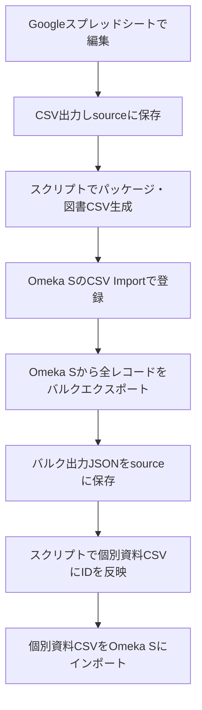

# AGMインデックスCSVインポート用データ生成プロセス

## 概要

このディレクトリは、Googleスプレッドシートで管理しているAGMインデックス（アナログゲームミュージアム所蔵品リスト）からOmeka Sへの登録用CSVを生成し、IDの連携・付与を正確に行うための一連の手順とスクリプトをまとめたものです。

## プロセス全体の流れ

1. **GoogleスプレッドシートからCSVを出力**
    - AGMインデックス（管理用スプレッドシート）をGoogleスプレッドシートで編集
    - 「ファイル」→「ダウンロード」→「カンマ区切りの値（.csv）」でCSVを出力
    - 出力したCSVを `source/` ディレクトリに保存

2. **CSVを読み取り、パッケージ（テーブルトップゲーム）・図書の登録用CSVを生成**
    - スクリプト（例: `index_parse.py` など）で `source/` のCSVを読み込む
    - テーブルトップゲーム・図書ごとにOmeka SのCSV Import用CSVを `output/` に生成

3. **Omeka SのCSV Import機能でパッケージ・図書を登録**
    - Omeka S管理画面の「CSV Import」機能を使い、生成したパッケージ・図書のCSVをインポート
    - インポート後、Omeka S側で各レコードに一意のID（o:id）が自動採番される

4. **Omeka Sから全レコードをバルクエクスポート**
    - Omeka Sの「バルクエクスポート」機能やAPI等で、全アイテムのJSONデータをエクスポート
    - エクスポートしたJSONファイルを `source/` ディレクトリに保存

5. **バルク出力したJSONを参照し、個別資料CSVにIDを反映**
    - スクリプト（例: `update_exemplar_of.py` など）で、
      - 個別資料CSVの各行の `dcterms:identifier` と、バルク出力JSON内の `dcterms:identifier` を突合
      - 対応するOmeka Sの `o:id` を `ag:exemplarOf` などのカラムに反映
    - 反映後の個別資料CSVを `output/` に保存

6. **個別資料CSVをOmeka Sにインポート**
    - 生成した個別資料CSVをOmeka SのCSV Import機能でインポート
    - これにより、個別資料とパッケージ/図書のID連携が正確に行われる

---

## ディレクトリ構成例

```
agm_index_to_import_csv/
├── source/
│   ├── AGMIndex_YYYYMMDD.csv         # Googleスプレッドシートから出力した元データ
│   └── omeka_bulk_export_YYYYMMDD.json # Omeka Sからバルクエクスポートした全レコードJSON
├── output/
│   ├── tabletop_games_YYYYMMDD.csv   # テーブルトップゲーム用CSV
│   ├── books_YYYYMMDD.csv            # 図書用CSV
│   └── individual_items_YYYYMMDD.csv # 個別資料用CSV（ID反映済み）
├── index_parse.py                    # CSV生成スクリプト例
├── update_exemplar_of.py             # JSON参照によるID付与スクリプト例
└── README.md                         # このファイル
```

## 主要スクリプトの役割

- `index_parse.py` :
    - sourceのCSVから、パッケージ・図書・個別資料の各CSVを生成
    - 個別資料CSVは、ID付与前の状態で出力
- `update_exemplar_of.py` :
    - Omeka SのバルクエクスポートJSONを参照し、個別資料CSVに正しいID（ag:exemplarOf等）を付与
    - 既存のIDがある場合は上書きせず、空欄のみを更新

## 出力ファイル例

- `output/tabletop_games_YYYYMMDD.csv` … テーブルトップゲーム登録用
- `output/books_YYYYMMDD.csv` … 図書登録用
- `output/individual_items_YYYYMMDD.csv` … 個別資料登録用（ID反映済み）

## ポイント・注意事項

- **IDの一貫性**: Googleスプレッドシートの「No.」や「バーコード」等を `dcterms:identifier` としてCSVに必ず含めることで、Omeka SのIDと突合しやすくなります。
- **バルクエクスポートJSONの構造**: Omeka SのバルクエクスポートJSONは配列形式で、各アイテムの `dcterms:identifier` と `o:id` をマッピングに利用します。
- **個別資料のID付与**: 既存の `ag:exemplarOf` などの値が空欄の場合のみ、JSONから付与します。
- **すべての出力ファイルは `output/` ディレクトリに保存してください。**

## 依存パッケージ
- pandas
- requests（必要に応じて）

## 参考：全体フロー図



---

## サポート

- スクリプトやデータ形式に関する質問は、管理者までご連絡ください。 